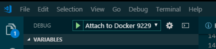
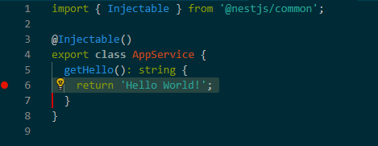
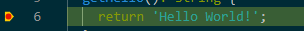
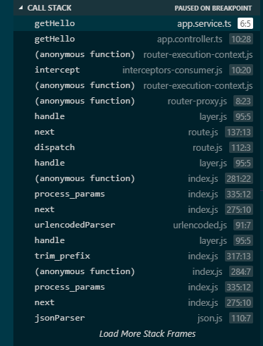

# dj-angular-ngrx

- created by : Anthony Leotta
- created on : April 3, 2019

## Setup Client

1. Init git
    ```
    git init    
    git remote add origin git@github.com:datajango/dj-angular-ngrx.git
    ```
1. Create new Angular Project
    ```
    ng new client
    y
    SCSS
    ```
1. Create or copy a .gitignore into project
1. Add source
    ```
    git add .
    git commit -m "first commit"
    git push -u origin master
    ```

## Follow along with Course

I setup a seperate project and I will be adding everytingmanually to thi sproject so I learn how todo every step.

```
git remote -v
origin  git@github.com:datajango/angular-ngrx-course.git (fetch)
origin  git@github.com:datajango/angular-ngrx-course.git (push)
```

Create a branch for first part of the project:

```
git checkout -b 1-auth origin/1-auth
```

## Setup Server

I will be using NestJS as a back-end not the default Node/Express server of the original project.  I'll also be using a fully containerized back-end with MongoDb rather than a flat JSON file serving the data,

1. npm i -g @nestjs/cli
1. Create Project
    ```
    nest new server
    ```
1. cd server
1. Add auth controller
    ```
    nest g controller auth
    ```
1. Add courses controller
    ```
    nest g controller courses
    ```    
1. Add lessons controller
    ```
    nest g controller lessons
    ```


## Setup for Server Debugging 

1. create .vscode configs
    1. launch.json
    1. settining.json
    1. tasks.json
1. cd server
1. add to package.json scripts
    ```    
    "postinstall": "tsc -p tsconfig.build.json",
    "watch": "tsc -w -p tsconfig.build.json",
    "debug:nodemon": "nodemon --inspect=0.0.0.0:9229 --nolazy --legacy-watch --watch ./dist ./dist/main.js",   
    "postinstall:err": "tsc -p ./src",      
    "watch:docker": "tsc -w -p tsconfig.build.json",    
    "debug:node": "node --inspect=0.0.0.0:9229 ./dist/main.js",
    ```
1. Exclude target output directoru 'dist'
    ```
    {
    "extends": "./tsconfig.json",
    "exclude": ["node_modules", "test", "dist", "**/*spec.ts"]
    }
    ```

## Setup Docker

1. create docker-compose.yml
1. set up containers for: 
    1. mongodb
    1. nginx proxy /api on port 9000
    1. maildev
    1. mongo-express
    1. node(nest) server om port 9000
1. docker-compose build --no-cache
1. docker-compose up 

## Test Node.js debugging inside docker containers from VS Code Studio

1. check docker server logs
    - look for line : 
    "Debugger listening on ws://0.0.0.0:9229/81e23c73-1c61-40b6-b69d-2dd55f8ce032"
    - if you see it yoru in business.
    - if not, woe is to you, teh insoector is nor running.  try moving teh nodemon.json out of the way. I renamed mine to nodemon-debug.json.notused and nodemon.json.notused
    ```
    > server@0.0.0 debug:nodemon /server
    > nodemon --inspect=0.0.0.0:9229 --nolazy --legacy-watch --watch ./dist ./dist/main.js

    [nodemon] 1.18.10
    [nodemon] to restart at any time, enter `rs`
    [nodemon] watching: /server/dist/**/*
    [nodemon] starting `node --inspect=0.0.0.0:9229 --nolazy ./dist/main.js`
    Debugger listening on ws://0.0.0.0:9229/81e23c73-1c61-40b6-b69d-2dd55f8ce032
    For help, see: https://nodejs.org/en/docs/inspector
    [Nest] 37   - 4/3/2019, 1:56:29 PM   [NestFactory] Starting Nest application...
    [Nest] 37   - 4/3/2019, 1:56:29 PM   [InstanceLoader] AppModule dependencies initialized +2ms
    [Nest] 37   - 4/3/2019, 1:56:29 PM   [RoutesResolver] AppController {/}: +10ms
    [Nest] 37   - 4/3/2019, 1:56:29 PM   [RouterExplorer] Mapped {/, GET} route +1ms
    [Nest] 37   - 4/3/2019, 1:56:29 PM   [RoutesResolver] AuthController {/auth}: +1ms
    [Nest] 37   - 4/3/2019, 1:56:29 PM   [RoutesResolver] CoursesController {/courses}: +0ms
    [Nest] 37   - 4/3/2019, 1:56:29 PM   [RoutesResolver] LessonsController {/lessons}: +1ms
    [Nest] 37   - 4/3/2019, 1:56:29 PM   [NestApplication] Nest application successfully started +0ms
    ```
1. tasks.json needs to run in a sub-folder
    ```
    {
        "version": "2.0.0",
        "tasks": [
            {
                "label": "tsc-watch",
                "command": "npm",
                "args": [
                    "run",
                    "watch"
                ],
                "type": "shell",
                "isBackground": true,
                "group": "build",
                "problemMatcher": "$tsc-watch",
                "presentation": {
                    "reveal": "always",
                },
                "options": {
                    "cwd": "${workspaceRoot}/server"
                }
            }       
        ]
    }
    ```
1. launch.json needs to run in the server folder also
    ```
    {
        "version": "0.2.0",
        "configurations": [
        {
            "type": "node",
            "request": "attach",
            "preLaunchTask": "tsc-watch",
            "name": "Attach to Docker 9229",
            "port": 9229,
            "address": "localhost",
            "protocol": "inspector",
            "restart": true,
            "localRoot": "${workspaceFolder}/server/dist",
            "remoteRoot": "/server/dist",
            "outFiles": [
            "${workspaceFolder}/server/dist/**/*.js"
            ],
            "skipFiles": [
            "<node_internals>/**/*.js",
            ]
        }
        ]
    }
    ```
1. Launch the Visual Stuio Code Debugger

    

1. Set a break point in the source code

    

1. Use curl on the comman-line or navigate in a web browser.

    - curl http://localhost:9000

    - The node.js server will pause on the break-point.

    

    - You can view the call-stack history

    

## Install Material

- Previews
    * https://material.angular.io?theme=indigo-pink
    * https://material.angular.io?theme=deeppurple-amber
    * https://material.angular.io?theme=pink-bluegrey
    * https://material.angular.io?theme=purple-green    
- Using the Angular CLI ng add command will update your Angular project with the correct dependencies, perform configuration changes and execute initialization code.
    ```
    ng add @angular/material

    Skipping installation: Package already installed
    ? Choose a prebuilt theme name, or "custom" for a custom theme: Pink/Blue Grey     [ Preview: https://material.angular.io?theme=pink-bluegrey ]
    ? Set up HammerJS for gesture recognition? Yes
    ? Set up browser animations for Angular Material? Yes
    UPDATE package.json (1395 bytes)
    npm WARN optional SKIPPING OPTIONAL DEPENDENCY: fsevents@1.2.7 (node_modules\fsevents):
    npm WARN notsup SKIPPING OPTIONAL DEPENDENCY: Unsupported platform for fsevents@1.2.7: wanted {"os":"darwin","arch":"any"} (current: {"os":"win32","arch":"x64"})

    added 3 packages from 4 contributors and audited 42614 packages in 7.221s
    found 0 vulnerabilities

    UPDATE src/main.ts (391 bytes)
    UPDATE src/app/app.module.ts (502 bytes)
    UPDATE angular.json (4063 bytes)
    UPDATE src/index.html (474 bytes)
    UPDATE src/styles.scss (181 bytes)
    ```
    
## npm packages

- Install npm dependencies

    ```
    npm install --save @angular-devkit/schematics
    npm install --save @angular/cdk
    npm install --save @angular/material-moment-adapter
    npm install --save rxjs-compat
    npm install --save @ngrx/store @ngrx/store-devtools @ngrx/effects @ngrx/entity @ngrx/router-store ngrx-store-freeze
    npm install --save @angular/http
    ```    
- Install npm dev dependencies

    ```       
    npm install --save-dev @ngrx/schematics
    npm install --save-dev @angular-devkit/build-angular
    ```

## Setup Proxy.json

- Create proxy.json in client folder in order to forward all requests with /api to the local development node.js server.
    ```
    {
        "/api": {
            "target": "http://localhost:9000",
            "secure": false
        }
    }
    ```

## Add Mongo lessons route to back-end server    

1. Add link to mongodb in docker-comppse.yml
    ```
    server:
    build: ./server
    volumes:
      - ./server/src:/server/src
      - ./server/dist:/server/dist
    ports:
      - "9000:9000"
      - "9229:9229"
    restart: always
    tty: true
    links:
      - mongodb
    ```
1. docker-compose down
1. cd server
1. install moongoose
    ```
    npm i --save @nestjs/mongoose mongoose
    npm i --save-dev @types/mongoose
    ```
1. make all changes to source    
1. docker-compose build
1. docker-compose up -d
1. Load Courses and Lessons
    - i used moingo-express and loaded a record documents manually in order to test that things are working corrcetly
    1. (This Curl command sdoes not work) curl -X POST http://localhost:9000/courses/ -H 'content-type: application/json'  -d '{ "description": "Angular for Beginners", "iconUrl": "https://angular-academy.s3.amazonaws.com/thumbnails/angular2-for-beginners-small-v2.png", "courseListIcon": "https://angular-academy.s3.amazonaws.com/main-logo/main-page-logo-small-hat.png', "longDescription": "Establish a solid layer of fundamentals, learn what's under the hood of Angular", "category": "BEGINNER", "lessonsCount": 10, "promo":true }'
1. curl -X GET http://localhost:9000/lessons
1. curl -X GET http://localhost:9000/courses

## Add Auth login

- [JWT Auth with NestJS, Passport and Express](https://codebrains.io/jwt-auth-with-nestjs-passport-and-express/)

1. Requirements
    - A user will create an account (if they do not have one already)
    - The account will be stored in the MongoDB database (if it has not been already)
    - The user will supply their email and password to sign in to the application
    - If the sign in is successful, the user will be supplied with a JWT that identifies them
    - Requests to any restricted routes will require that the JWT is sent along with the request in order to access it

1. Install more npm packages
    
    ```
    npm install --save @nestjs/swagger
    npm install --save passport passport-http-bearer 
    npm install --save passport-jwt 
    npm install --save passport-local 
    npm install --save passport-local-mongoose
    npm install --save joi jsonwebtoken 
    npm install --save @nestjs/passport 
    npm install --save @types/joi 
    npm install --save @types/passport-local-mongoose    
    ```

1. Generate users module
    ```
    docker-compose down
    cd server
    nest generate module users 
    nest generate controller users
    nest generate service users
    ```
1. Generate auth module
    ```
    nest generate module auth 
    nest generate controller auth
    nest generate service auth
    ```
